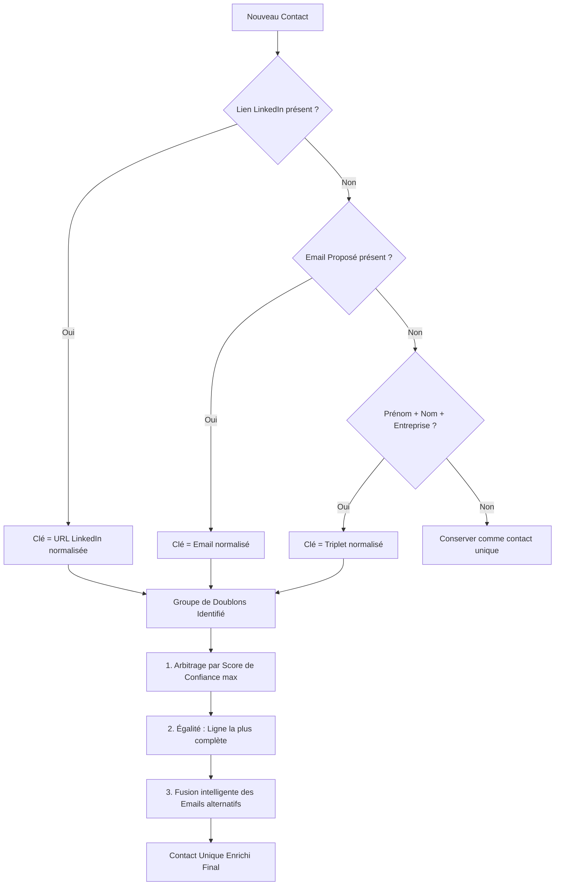

# ⚡ FUSION — Fusionneur Excel avec Déduplication Intelligente


**Fusion** est une application Python moderne avec interface **Streamlit** conçue pour fusionner intelligemment de multiples fichiers Excel (de 5 à 50+ fichiers) issus d'extractions de prospection (ex: *LinkedIn Prospector*), éliminer les doublons selon un algorithme en cascade à 3 niveaux et générer un classeur Excel final nettoyé, stylisé et prêt pour vos campagnes.

---

## 🚀 Fonctionnalités Clés

- 📥 **Importation Multiple (Drag & Drop)** : Accepte les formats `.xlsx` et `.xls`, affiche le récapitulatif des fichiers et leur taille.
- 🎯 **Déduplication en Cascade (3 Critères)** :
  1. **Lien Profil LinkedIn** (priorité absolue avec normalisation des URLs).
  2. **Email Proposé** (si LinkedIn absent).
  3. **Triplet `Prénom` + `Nom` + `Entreprise`** (si LinkedIn et Email absents).
- 🧠 **Arbitrage Intelligent des Conflits** :
  - Priorise la ligne ayant le **Score de Confiance (%)** le plus élevé.
  - En cas d'égalité, sélectionne la ligne la plus complète (moins de valeurs vides).
  - **Fusion des emails alternatifs** : conserve toutes les adresses valides trouvées dans le groupe de doublons pour alimenter `Email Alternatif 1` et `Email Alternatif 2`.
- 📊 **Tableau de Bord & KPIs en Direct** :
  - Nombre de fichiers traités, lignes brutes, doublons éliminés, contacts uniques finaux et taux de déduplication.
  - Graphique interactif **Plotly** : Top 10 des entreprises représentées et répartition du statut MX.
- 🎨 **Export Excel Professionnel (openpyxl)** :
  - En-têtes stylisés aux couleurs de LinkedIn (`#0A66C2`, texte blanc en gras).
  - Filtres automatiques activés sur toutes les colonnes.
  - Largeurs de colonnes ajustées dynamiquement.
  - **Coloration conditionnelle du Statut MX** :
    - 🟢 **Validé** : Fond vert doux (`#D4EDDA`)
    - 🟡 **À vérifier** : Fond jaune doux (`#FFF3CD`)
    - 🔴 **Invalide** : Fond rouge doux (`#F8D7DA`)
- 📜 **Console de Logs en Temps Réel** : Suivi interactif avec coloration selon le niveau (`INFO`, `WARNING`, `ERROR`) et persistance journalière dans `logs/fusion_YYYYMMDD.log`.

---

## 📋 Structure des Colonnes Attendues

| Colonne | Description |
| :--- | :--- |
| **Prénom** | Prénom du contact |
| **Nom** | Nom de famille |
| **Poste Actuel** | Intitulé du poste / fonction |
| **Entreprise** | Nom de la société |
| **Email Proposé** | Adresse email principale |
| **Email Alternatif 1** | Premier email secondaire |
| **Email Alternatif 2** | Deuxième email secondaire |
| **Score de Confiance (%)** | Fiabilité estimée de l'email (0 à 100%) |
| **Statut MX** | `Validé` / `À vérifier` / `Invalide` |
| **Serveur MX Actif** | `Oui` / `Non` |
| **Lien Profil LinkedIn** | URL du profil LinkedIn |
| **Date d'Extraction** | Date de récupération de la donnée |

---

## 📂 Architecture du Projet

```
fusion/
├── app.py                      # Interface Streamlit principale
├── core/
│   ├── __init__.py
│   ├── file_reader.py          # Lecture et validation robuste des fichiers Excel
│   ├── deduplicator.py         # Moteur de déduplication en cascade et filtres
│   ├── exporter.py             # Générateur et stylisateur Excel openpyxl
│   └── logger.py               # Double logging (Fichier journal + Buffer UI)
├── data/
│   └── uploads/                # Répertoire de stockage temporaire
├── output/                     # Répertoire des exports générés
├── logs/                       # Journaux d'exécution journaliers
├── tests/
│   ├── __init__.py
│   ├── test_file_reader.py     # Tests de lecture et gestion des erreurs
│   ├── test_deduplicator.py    # Tests de déduplication et priorités
│   └── test_exporter.py        # Tests de génération et styles Excel
├── requirements.txt            # Dépendances Python
├── .gitignore                  # Fichiers ignorés par Git
├── README.md                   # Documentation du projet
└── LICENSE                     # Licence MIT
```

---

## 🛠️ Installation & Lancement

### 1. Cloner le projet
```bash
git clone https://github.com/medhsiny2003/fusionne.git
cd fusionne
```

### 2. Créer et activer un environnement virtuel (recommandé)
```bash
# Windows
python -m venv venv
venv\Scripts\activate

# Linux / MacOS
python3 -m venv venv
source venv/bin/activate
```

### 3. Installer les dépendances
```bash
pip install -r requirements.txt
```

### 4. Lancer l'application Streamlit
```bash
streamlit run app.py
```
L'interface est immédiatement accessible sur [http://localhost:8501](http://localhost:8501).

---

## 🧪 Lancer la Suite de Tests

Le projet inclut une suite de tests unitaires automatisés validant 100% des cas d'usage :
```bash
pytest -v
```

---

## ⚙️ Logique de Déduplication



---

## 📄 Licence

Ce projet est sous licence **MIT**. Voir le fichier [LICENSE](LICENSE) pour plus de détails.
